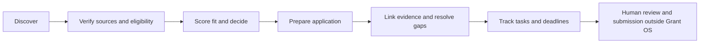
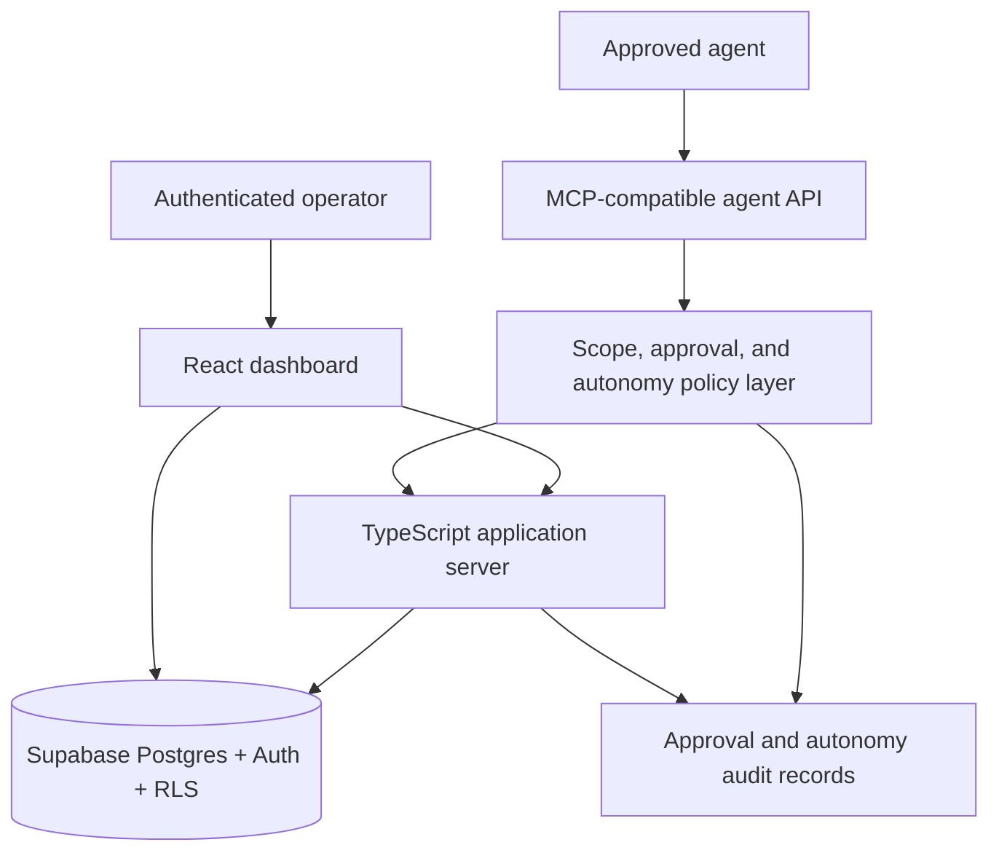

<p align="center">
  <a href="https://playa-ai.org">
    
  </a>
</p>

<h1 align="center">Grant OS</h1>

<p align="center">
  <strong>Agent-ready funding intelligence and grant operations for Playa AI.</strong>
</p>

<p align="center">
  <a href="https://grant-os.replit.app">Live app</a> ·
  <a href="https://playa-ai.org">Playa AI</a> ·
  <a href="https://playa-ai.org/work">Public work</a> ·
  <a href="mailto:team@playa-ai.org">Contact</a>
</p>

<p align="center">
  
  
  
  
  <a href="LICENSE"></a>
</p>

---

Grant OS is the funding-intelligence and grant-operations platform used by [Playa AI](https://playa-ai.org). It brings opportunities, projects, applications, tasks, evidence, deadlines, and agent workflows into one governed workspace so operators can decide what to pursue and move an application forward without losing the evidence behind the decision.

> [!IMPORTANT]
> Grant OS is in active development. It supports internal research and operations; it does not submit grant applications, send funder outreach, establish eligibility, or turn unverified statements into approved claims. Operators remain responsible for final eligibility, legal, financial, and submission decisions.

## Why Grant OS

Grant work often fragments across spreadsheets, browser tabs, documents, task managers, and AI chats. Grant OS is designed around a single operational chain:



The goal is not simply to collect more opportunities. The goal is to maintain a trustworthy, auditable record of why an opportunity is active, what remains unproven, and what should happen next.

## Capabilities

| Area | What Grant OS provides |
| --- | --- |
| Grant intelligence | Opportunity tracking, source metadata, deadline monitoring, duplicate detection, fit and priority context, cleanup previews, and next-target recommendations. |
| Application operations | Grant-to-application creation, readiness context, application notes, linked questions and documents, and duplicate prevention. |
| Tasks and checklists | Linked application checklists, task ownership, due dates, status tracking, and deadline-aware work queues. |
| Evidence and claims | Proof library, missing-evidence reports, verification metadata, responsible owners, and knowledge proposals that remain subject to review. |
| Agent access | Compact MCP-style tools, scoped opaque tokens, dry-run previews, mutation approvals, bounded autonomous grant operations, and change readbacks. |
| Governance | Supabase authentication, role-aware access, Row Level Security, audit metadata, token expiry and revocation, idempotency, and replay protection. |

## Agent operating model

Grant OS treats agents as permissioned operators, not database administrators.

### Compact reads

Read tools default to decision-oriented responses rather than raw documents or long imported text. Agents can inspect priority grants, deadlines, application readiness, proof gaps, token capabilities, and recent changes without loading the entire workspace.

### Safe writes

Internal mutations follow one of two controlled paths:

1. **Preview and approval** — an agent produces a deterministic mutation plan; an authenticated Admin or Grant Lead reviews and executes it through the dashboard under the user's Supabase session and existing RLS.
2. **Bounded autonomy** — an explicitly scoped token may perform allowlisted, reversible internal grant operations within its token-bound policy, batch limits, expiry, and idempotency controls.

Newly discovered grants begin in `Researching` and are not automatically promoted to Top 3. Autonomous execution remains limited to internal records and does not authorize external submission or outreach.

### Intentionally unavailable

- Hard deletion through MCP
- External application submission
- Automated funder outreach
- Arbitrary SQL, table, or field mutation
- RLS or access-policy changes
- Direct approval of unverified knowledge or claims
- Service-role credentials in agent or browser responses

## Trust and evidence rules

Grant OS separates source evidence from operational judgment. A verified URL does not, by itself, prove applicant eligibility or authorize a claim.

- Prefer primary funder and application sources.
- Record verification status, source URL, last-verified date, and responsible owner.
- Treat secondary public databases as supporting evidence, not primary legal proof.
- Keep `Needs Proof`, `Needs Confirmation`, `Background Only`, and `Do Not Use` claims out of approved application language.
- Preserve Playa AI and Mystic Arts Foundation as legally and financially distinct entities.
- Do not represent Playa AI as having standalone tax-exempt status without primary documentation.
- Do not represent an official partnership with any outside organization without primary evidence.
- Treat old drafts, transcripts, AI chats, and generated research notebooks as non-authoritative until independently verified.

## Architecture



### Technology

- React, TypeScript, Vite, and Tailwind CSS
- Supabase Auth, PostgreSQL, Storage, and Row Level Security
- TanStack Query and Zod
- MCP-compatible HTTP adapter and explicit agent-tool registry
- Replit deployment
- pnpm workspace

## Repository layout

```text
artifacts/grant-os/
├── src/
│   ├── components/          Dashboard and public UI
│   ├── lib/agent-mcp/       MCP adapter, tokens, approvals, and autonomy policy
│   ├── lib/agent-tools/     Read, planning, and write-safe tools
│   ├── pages/               Public and authenticated routes
│   └── server/              Application and agent API server
├── supabase/
│   ├── migrations/          Ordered schema, auth, RLS, and agent migrations
│   └── manual-cleanup/      Preview-first operational cleanup SQL
├── test-simulations/        Agent, MCP, auth, approval, and workflow simulations
└── scripts/                 Agent diagnostics and local tool runner
```

The repository is a pnpm workspace. Grant OS lives in `artifacts/grant-os`; other workspace artifacts are outside the application's release scope.

## Local development

### Prerequisites

- Node.js 20 or newer
- pnpm 10
- A non-production Supabase project for local development

### Install

```bash
git clone https://github.com/PlayaAI/funding-intelligence-platform.git
cd funding-intelligence-platform
npx pnpm@10 install
```

### Configure

Create a local `.env` file that is excluded from Git and provide only the browser-safe Supabase configuration:

```bash
VITE_SUPABASE_URL=https://your-project.supabase.co
VITE_SUPABASE_ANON_KEY=your-anon-or-publishable-key
```

Never place service-role keys, user access tokens, MCP tokens, or production exports in source control. See [SUPABASE_SETUP.md](SUPABASE_SETUP.md) for the setup guide. Apply the SQL migrations in `artifacts/grant-os/supabase/migrations/` in numeric order against a non-production project before local testing.

### Run

```bash
npx pnpm@10 --filter @workspace/grant-os run dev
```

The default local URL is `http://localhost:5173` unless the environment supplies another port.

## Validation

Run the core release checks from the repository root:

```bash
npx pnpm@10 --filter @workspace/grant-os run typecheck
npx pnpm@10 --filter @workspace/grant-os run build
npx pnpm@10 --filter @workspace/grant-os run test:simulations
npx pnpm@10 --filter @workspace/grant-os run test:agent-tools
npx pnpm@10 --filter @workspace/grant-os run test:agent-auth
npx pnpm@10 --filter @workspace/grant-os run test:agent-api
npx pnpm@10 --filter @workspace/grant-os run test:agent-mcp
npx pnpm@10 --filter @workspace/grant-os run test:agent-mcp-full
npx pnpm@10 --filter @workspace/grant-os run test:agent-mcp-tokens
npx pnpm@10 --filter @workspace/grant-os run test:agent-mcp-approvals
npx pnpm@10 --filter @workspace/grant-os run test:agent-mcp-autonomy
```

These are simulation suites by default. They must not mutate the production database. Production release verification additionally requires live auth, RLS, migration, route, and readback checks in the deployed environment.

## Deployment

The current hosted application is available at [grant-os.replit.app](https://grant-os.replit.app).

A production release should follow this order:

1. Validate typecheck, build, simulations, and secret scans.
2. Apply new Supabase migrations intentionally and verify RLS.
3. Merge the reviewed source commit.
4. Pull `main` into the Replit workspace.
5. Republish the application.
6. Verify the deployed source version, protected routes, MCP manifest, and write readbacks.

See [the production checklist](artifacts/grant-os/PRODUCTION_CHECKLIST.md) for release and rollback guidance.

## Security

Please do not disclose vulnerabilities, credentials, private grant data, or access tokens in a public issue. Follow [SECURITY.md](SECURITY.md) and report sensitive findings privately to [team@playa-ai.org](mailto:team@playa-ai.org).

## Contributing

Grant OS is maintained as an active Playa AI project. Read [CONTRIBUTING.md](CONTRIBUTING.md) before proposing changes. Keep pull requests scoped, preserve RLS and claim-safety boundaries, and include proportional validation evidence.

## License

The software in this repository is available under the [MIT License](LICENSE).

The license does not grant rights to Playa AI names, logos, trademarks, private operational data, third-party grant materials, or third-party assets. Those materials remain subject to their respective owners and terms.

## About Playa AI

[Playa AI](https://playa-ai.org) is a human-centered AI initiative developing consent frameworks, community experiments, tools, and public-interest research rooted in creativity, participation, and human flourishing.

<p align="center">
  <strong>AI needs culture.</strong><br>
  <a href="https://playa-ai.org/manifesto">Read the Manifesto</a> ·
  <a href="https://playa-ai.org/living-trust-framework">Explore the Living Trust Framework</a>
</p>
